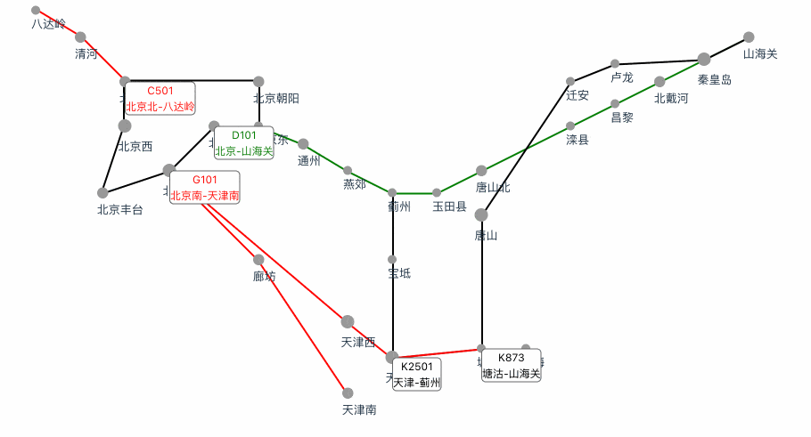

# 轨道交通图

一个 React 实现的火车模拟路线图，展示东北、华北地区告诉铁路网运行图。

- 支持多个大型铁路枢纽：北京、天津、石家庄、济南，哈尔滨，沈阳，包括城市，站点，车次等信息。

- 支持动态效果，根据时间，动态显示列车的运行位置。

- 支持基本用户交互，可以根据缩放、平移来查看铁路网图。

说明：本项目不代表真实数据和运行时刻表，仅供技术学习和个人娱乐。

:heart: 感谢您的支持，如果喜欢可以点一个 star。

如果有问题，可以点击 issue 或者 pull request。

[技术背景](./docs/function.md)

[产品效果](./docs/product-requirement.md)

[技术细节](./docs/technical-detail.md)

[更新日志](./docs/change-log.md)

[English](./README-en.md)

在线演示：https://michael18811380328.github.io/demo/train-route-map/index.html

