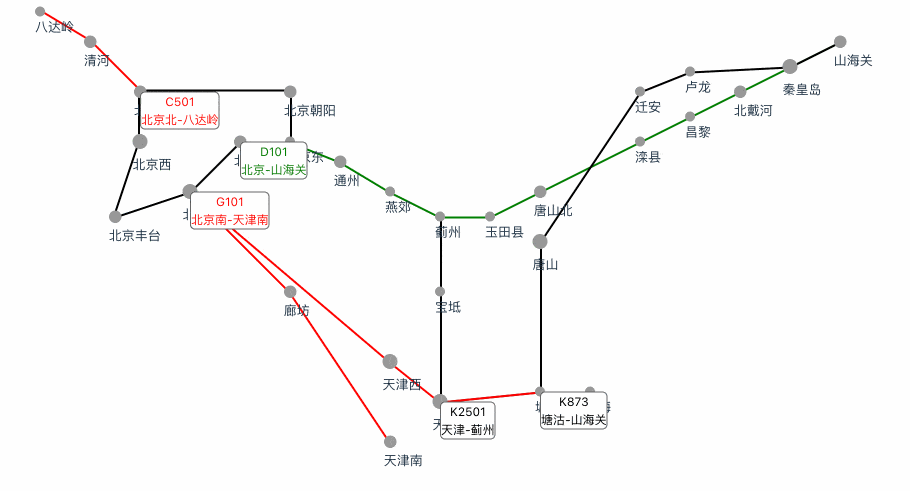

# 轨道交通图

[English](./README-en.md)

一个基于 React 开发的交互式火车路线模拟系统，展示全国主要铁路网运行图，包括城市、站点、车次、路线等完整信息。

支持动态列车运行效果，根据时间实时显示列车位置变化，提供丰富的用户交互功能。



## ✨ 核心功能

### 🗺️ 地图交互
- 动态缩放：支持地图缩放查看不同区域细节
- 平移浏览：可拖动地图查看全国铁路网络
- 移动端适配：完美支持手机和平板设备

### 🚉 站点管理
- 站点展示：显示全国主要火车站，按等级分类（1-5级）
- 点击添加：支持在地图上点击添加新站点
- 站点筛选：提供"全部车站"功能，可按名称和编号筛选
- 站点详情：点击站点查看详细信息，包括经过车次

### 🚄 车次管理
- 实时运行：根据时间动态显示列车运行位置
- 车次分类：支持高铁(G)、动车(D)、城际(C)、普快(K)等不同类型
- 车次筛选：提供"全部车次"功能，查看所有列车信息
- 添加车次：支持自定义添加新列车路线

### 📊 数据管理
- 数据导出：支持将站点和车次数据导出
- 离线模式：支持本地数据存储和离线使用
- 数据分类：站点按省份ID进行分组管理

### 🎛️ 界面功能
- 左侧信息栏：显示车站、路线、车次列表，可展开折叠
- 设置面板：提供背景音乐、地图设置等选项
- 响应式设计：适配不同屏幕尺寸

## 🛠️ 技术栈

- 前端框架：React 18
- UI组件库：Reactstrap (基于 Bootstrap)
- 地图渲染：Canvas + 自定义渲染引擎
- 状态管理：React Hooks
- 构建工具：Vite

## 🚀 快速开始

### 安装依赖
```bash
npm install
```

### 开发模式
```bash
npm run dev
```

### 构建生产版本
```bash
npm run build
```

## 📈 数据覆盖

项目目前覆盖以下地区的铁路网络：

- 华北地区：北京、天津、河北、山西、内蒙古
- 东北地区：黑龙江、吉林、辽宁
- 华东地区：山东、江苏、安徽、上海
- 华中地区：河南、陕西
- 西北地区：宁夏、甘肃

包含主要高铁线路如京沪高铁、京广高铁、哈大高铁、徐兰高铁等。

## ⚠️ 说明事项

- 本项目为技术学习和个人娱乐用途，不代表真实运营数据和时刻表
- 数据基于公开信息整理，可能与实际情况存在差异
- 欢迎提交 Issue 或 Pull Request 来改进项目

## 🔗 相关文档

- [功能说明](./docs/function.md) - 详细的功能介绍和铁路知识
- [技术细节](./docs/technical-detail.md) - 技术实现原理和代码结构
- [更新日志](./docs/change-log.md) - 版本更新记录

## 🌐 在线演示

访问在线演示：https://michael18811380328.github.io/demo/train-route-map/index.html

## 💖 支持项目

如果这个项目对您有帮助，欢迎点个 Star 支持！

如果有任何问题或建议，欢迎提交 Issue 或 Pull Request。
