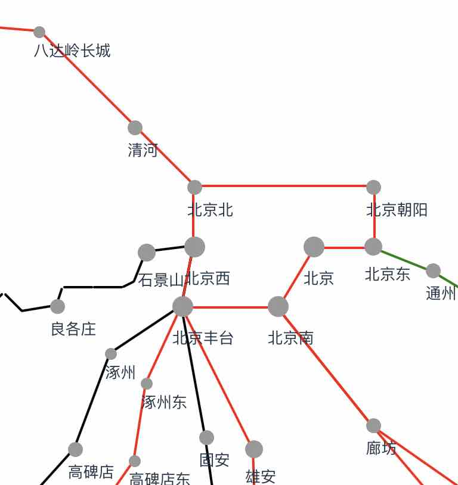
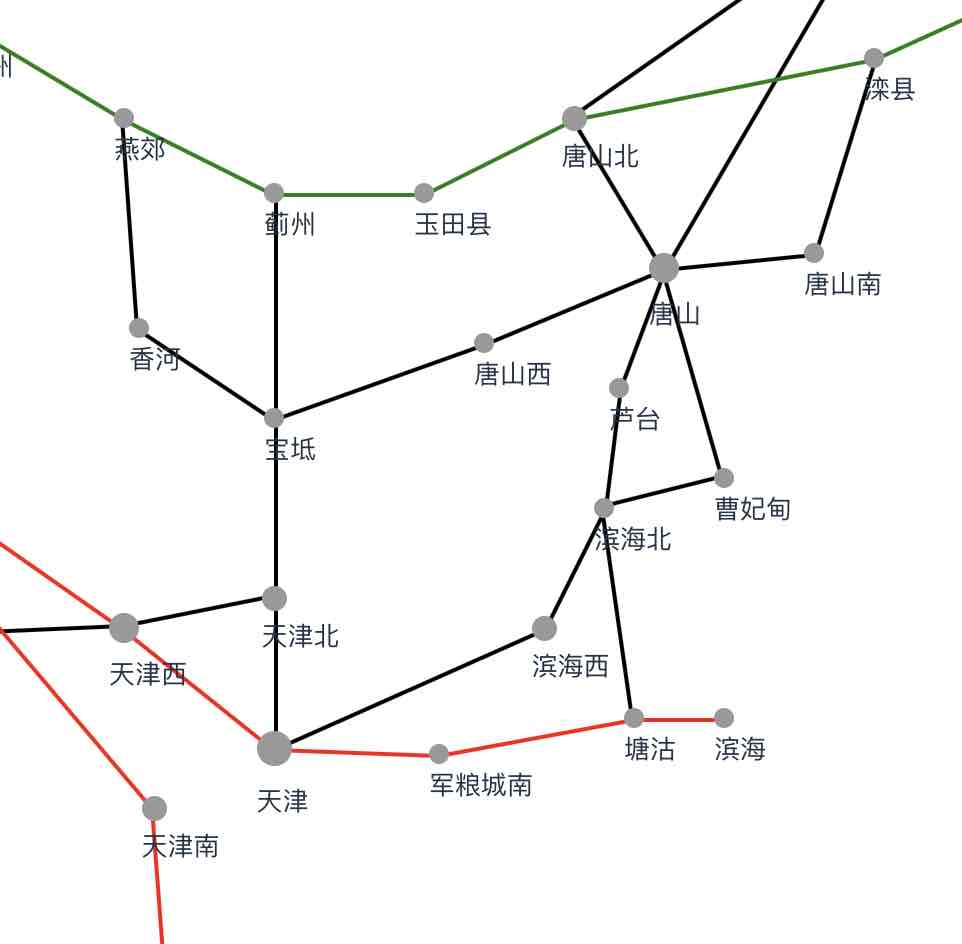
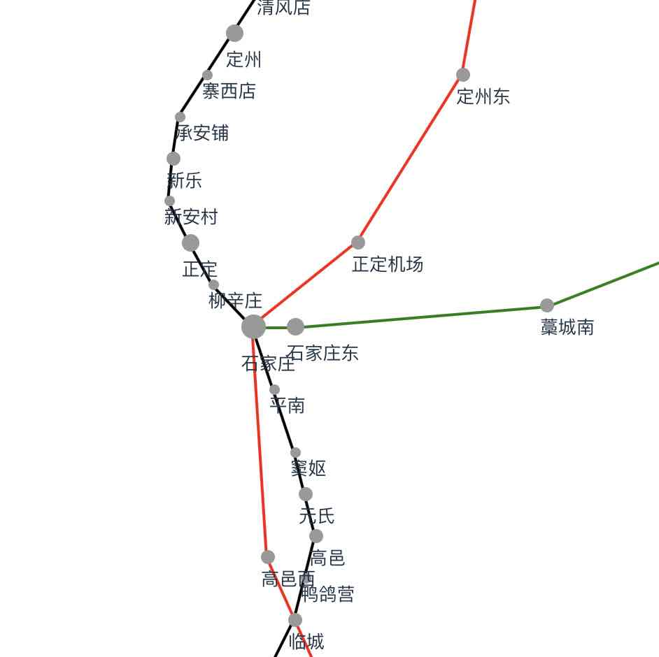
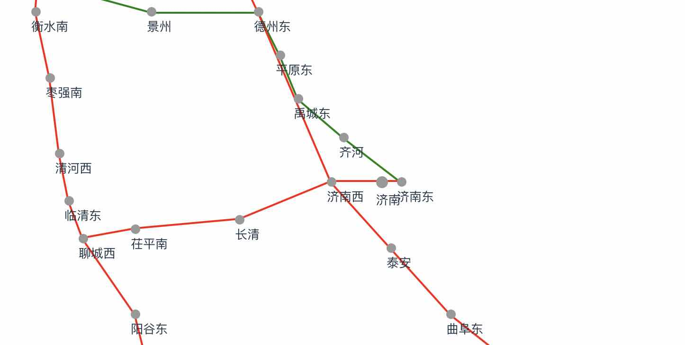
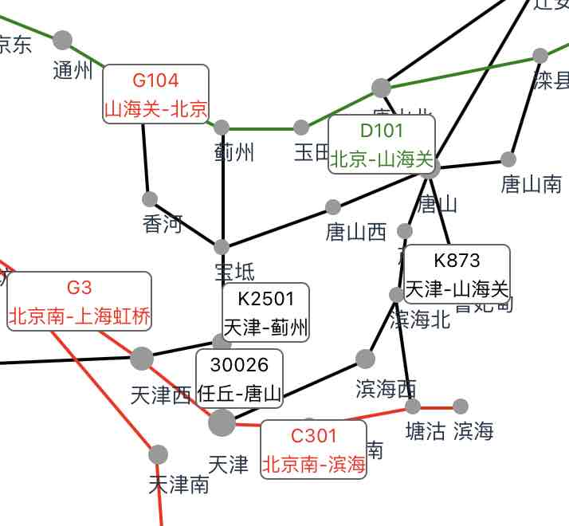
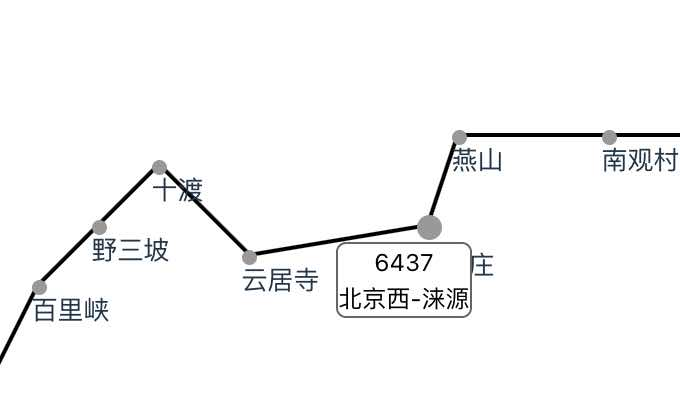
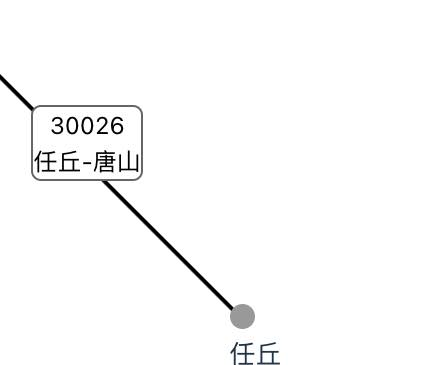

# 技术背景

本模拟器深度融合地理与铁路交通领域专业知识，旨在为用户提供良好的游玩体验。

在深入探讨之前，我们有必要先了解一些专业概念，以便后续使用。

下面简单介绍铁路枢纽，车站，路线，车次等基本概念。

## 1 铁路枢纽

铁路枢纽是指在铁路网中，几条铁路干线交或衔接的地点，由若干个车站、站间联络线、进站线和信号等组成的总体。它不仅承担着大量的客货运输任务，还是铁路运输组织的关键环节。枢纽的布局合理与否，直接关系到铁路运输的效率和安全性。

我国铁路枢纽众多，包括全国性铁路枢纽和区域性铁路枢纽。

本案例包括四个枢纽，分别是北京铁路枢纽、天津铁路枢纽、石家庄铁路枢纽、济南铁路枢纽。

### 北京铁路枢纽

北京铁路枢纽是连接八个方向的全国最大的铁路枢纽，有京广线、京沪线、京九线、京包线、京通线、京哈线、京原线等众多铁路干线呈辐射状通向全国各地。

北京铁路枢纽的核心区形成以北京站、北京南站、北京西站为主的内环，和以北京丰台站、丰台西站、双桥站等外环外环线。通过环线连接京广、京山、京包、京原、京九、京承、京秦、京通、丰沙等铁路干线。

其中北京站、北京西站、北京南站、北京丰台站属于特大型客运站，丰台西站、双桥站属于路网性编组站，北京北站、北京朝阳站等大型客运站，北京东站、广安门站、大红门站、百子湾站、石景山南站等货运站组成。

本案例主要包括北京枢纽客运线路，包括北京站、北京南站、北京西站，北京丰台站，北京朝阳站，北京北站等站点。

### 天津铁路枢纽

天津铁路枢纽是北方最大的海陆交通中心，也是京山、京沪两大铁路干线的交汇处。它通过津霸联络线与京九铁路相连，还与北京市、河北省廊坊、唐山、沧州等地连接，是天津市和华北地区的物资集散点。

本案例主要包括天津枢纽货运路线，包括天津北，天津西，天津，塘沽，唐山等站点。

### 石家庄铁路枢纽

石家庄铁路枢纽位于京广铁路、石太铁路、石德铁路三条铁路干线的交汇点。它东经石德线至德州编组站，西经石太线至太原铁路枢纽，南经京广线至郑州铁路枢纽，北经京广线至北京铁路枢纽。石家庄铁路枢纽以五条联络线及一条环线为中心，向四周14个方向放射出14条铁路，并辅以三座客运站（石家庄站、石家庄北站、石家庄东站）、一座超大型编组站（永壁编组站）及两座编组场。

本案例仅包括京广线，京广高铁，石济客专，分别代表三种线路。

### 济南铁路枢纽

济南铁路枢纽地处山东省省会济南市，位于京沪铁路、胶济铁路、邯济铁路干线交汇点。它由京沪正线（晏党线）、济南铁路（京沪三四线/南环和北环线）、老津浦线（济晏线/邯济铁路引入线）、邯济铁路至胶济铁路联络线、黄东联络线等联络线，以及水白线等组成。济南铁路枢纽内共有21个车站和1个线路所，其中济西站为路网性编组站，晏城北站为辅助编组站，济南站为客货混合站，大明湖站（原济南东站）为辅助客运站。

本案例仅包括济南部分高铁和客专线路。

## 2、车站

车站是铁路线上供列车停靠、旅客上下车、货物装卸的地点。根据功能和业务量大小，车站被划分为六个等级，每个等级的车站承担着不同的运输任务和服务功能。本案例分析特等站、一等站、二等站、三等站、四等站。

### 特等站

特等站为铁路车站中的最高级别。一般是一些大型铁路枢纽的核心车站，拥有庞大的客货运输量和复杂的线路结构。全国共有特等站69个。

本案例中，北京南站、北京西站、北京站等是特等站。

### 一等站

一等站日均上下车及换乘旅客数量、日均装卸车数量以及日均办理有调作业车数量达到一定标准的车站，或位于省府所在地及重要的国境站、口岸站，可酌定为一等站。全国共有一等站243个。

本案例中，北京东站、天津西站、天津北站、塘沽站、秦皇岛站是一等站（对应省会或者货运编组所在地）。

### 二等站

二等站日均上下车及换乘旅客数量、日均装卸车数量以及日均办理有调作业车数量达到二等站标准的车站。此外，工矿企业比较集中地区所在地的车站及位于三个方向以上并担当机车更换、列车技术作业的车站，也可酌定为二等站。全国共有二等站437个。

本案例中，北京北站、高碑店站、良各庄站等是二等站（对应地级市或者货运编组所在地）。

### 三等站

三等站日均上下车及换乘旅客数量、日均装卸车数量以及日均办理有调作业车数量达到三等站标准的车站中业务量较大的车站。同时，工矿企业比较集中地区所在地的车站及位于三个方向以上并担当机车更换、列车技术作业的车站，也可酌定为三等站。截至2014年末，全国共有三等站910个，如很多县城或较大镇上的火车站。

本案例中，元氏站、涿州站、涞源站等是三等站（对应县城所在地）。

### 四等站

四等站办理综合业务，但客货运业务量较少的车站，或日均上下车及换乘旅客在2000人以下，办理到发、中转行包在100件以下的车站。

本案例中，由于四等站数量太多，默认缩放比例不显示四等站，需要放大后才显示四等站。

本案例中，十渡站，野三坡站，百里峡站等是四等站（对应乡镇所在地）。

### 五等站

五等站在铁路干线上，业务量很小，或只是为了工区或沿线职工服务的会让站或越行站。

本案例不显示五等站。

## 3、路线

路线，即铁路线，是列车行驶的轨道基础，它依据地形地貌、城市规划、经济需求等多重因素设计，形成了四通八达的铁路网络。不同的铁路线根据其设计速度、服务对象（如高铁、普速、货运等）和技术标准，有着各自的运营特点和适用场景。

高铁、客运专线、普通线路以及联络线扮演着重要的角色，它们之间存在着显著的差异，这些差异主要体现在设计标准、运营速度、功能定位以及服务对象上。

高铁是高速铁路的简称，设计时速通常超过250公里/小时到350公里/小时以上。高铁线路通常采用无砟轨道，以减少摩擦和提高运行效率。高铁主要服务于城市间的长途旅客运输，极大地缩短了城市间的时空距离。

客运专线，全称客运列车专线铁路。客运专线的种类繁多，按铁路行政（区域）性质可分为国家铁路干线、区际铁路、城际轨道和（市郊）市域快铁。客运专线的主要特点是只运行旅客列车和技术作业列车，不运行货物列车。这使得客运专线在铁路等级中的地位高于客货共线和货运专线。客运专线的速度等级不一，从快速铁路到高速铁路不等，但总体上都比普通线路要快。

本案例中，以济南枢纽为例，包含京沪高铁、京港高铁、济郑高铁三条红色的高铁线路，运行时速 350，石济客专1条绿色的客运专线，运行时速 250。

普通线路则是指设计时速较低的铁路线路，通常不超过160公里/小时。普通线路主要用于客货共线运输，即同时运行旅客列车和货物列车。这使得普通线路在运输能力上更加灵活，但同时也限制了其运行速度。普通线路是铁路交通体系的基础，它连接着全国各地的城市和乡村，为人们的出行和货物的运输提供了重要的交通保障。

联络线专用线则是铁路交通体系中的特殊线路。联络线主要用于连接不同的铁路线路或车站，以实现列车的跨线运行或换乘。联络线的存在提高了铁路网络的灵活性和连通性，使得列车可以在不同的线路之间自由切换，从而提高了铁路运输的效率。而专用线则是指专门为某一特定目的或行业服务的铁路线路，如煤炭专线、钢铁专线等。专用线的存在使得特定行业的货物运输更加高效、便捷。

本案例中，以天津枢纽为例，除了红色的高铁线路和绿色的客专线路，还有大量黑色的普速铁路、联络线、专用线。例如津山铁路，唐曹铁路、津蓟线、津霸线等。

## 4、车次

在铁路交通体系中，车次信息是用来区分不同列车类型、运行方向、运行区段以及运行时刻的重要标识。

车次信息是铁路旅客服务的重要组成部分，它包含了列车的类型（如高铁G、动车D、城际C、普快K及慢车等）、始发站与终点站、发车与到达时间、停靠站点等详细信息，是旅客规划行程、选择出行方式的重要依据。

下面将简单介绍高铁G、动车D、城际列车C、普快K、慢车（4位纯数字）、货车（5位纯数字）等车次信息的含义。

### 高铁G

G代表高速动车组列车，是目前运行速度最快的铁路列车之一。设计时速通常在300-350公里/小时之间，主要用于连接大城市之间的长途旅客运输，如北京到上海、广州到深圳等。

### 动车D

D代表动车组列车，是介于高速列车和普通列车之间的一种铁路列车。设计时速通常在200-300公里/小时之间，连接城市间的中短途旅客运输。

### 城际列车C

C代表城际动车组列车，是专门服务于相邻城市间的铁路列车。设计时速较高，通常在160-350公里/小时之间（根据不同线路和车型有所不同），具有运行速度快、停靠站点少、发车频次高等特点。主要用于相邻城市间的快速旅客运输，如北京到天津、上海到南京等。

### 普通快速客车K

K代表快速旅客列车，是中等速度的铁路列车，设计时速通常在120公里/小时左右，停靠站点较多，适合中长途旅客运输。广泛连接省际和区域内的城市，提供经济实惠的旅客运输服务。

### 普通客车

4位纯数字车次通常代表普通旅客列车或慢车。运行速度较慢，停靠站点多，几乎逢站必停，适合短途或沿线多个站点的旅客运输。使用场景：主要用于连接城市与乡村、小城镇之间的旅客运输，提供便捷的出行服务。

### 货车

5位纯数字车次通常代表货运列车。专注于货物运输，不搭载旅客。根据货物类型和运输需求，货车可能采用不同的车型和编组方式。广泛连接全国各地的货运站点和工厂，为经济发展提供重要的物流支持。

